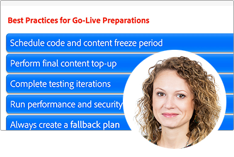

# Adobe Developers Live {#overview}

Adobe Developers Live reúne a desarrolladores y creadores de experiencias de Adobe con diversos antecedentes y un único propósito: construir experiencias integrales increíbles. Esta conferencia de dos días incluirá importantes actualizaciones para desarrolladores, sesiones técnicas y oportunidades para establecer contactos con la comunidad.

Los equipos de productos de Adobe de Adobe Experience Cloud, Document Cloud y Creative Cloud mostrarán los últimos avances tecnológicos y las herramientas para desarrolladores que impulsan el diseño, los flujos de trabajo de creación de contenido, los servicios de documentos y la administración de experiencias del cliente en todos los sectores.

Regístrese para futuros eventos **[aquí](https://developerevents.adobe.com/)**.

>[!TIP]
>
>**Todas las sesiones grabadas se muestran en el panel de navegación de la izquierda**.

## Octubre de 2021

Los equipos de productos de Adobe de Adobe Experience Cloud, Document Cloud y Creative Cloud muestran los últimos avances tecnológicos y las herramientas para desarrolladores que impulsan el diseño, los flujos de trabajo de creación de contenido, los servicios de documentos y la administración de experiencias del cliente en todos los sectores.

Eche un vistazo a todos los demás [sesiones](2021/october/overview.md) !

<table>
  <tr>
   <td>
      
      

         <a href="2021/october/headless.md"><strong>Sitios sin encabezado</strong></a>         
          <em>con Mathias Siegl, director de producto principal de AEM Sites</em>
      

      

         
         Con GraphQL AEM para fragmentos de contenido disponible para la versión 6.5 y Adobe Experience Manager as a Cloud Service, vamos a explorar cómo se puede utilizar Adobe Experience Manager como CMS sin encabezado.
      

     </td>   
     <td>
      
      

         <a href="2021/october/aep-integration.md"><strong>Información general sobre la integración de Adobe Experience Platform</strong></a>
          <em>con Eric Knee, arquitecto principal de soluciones empresariales</em>
      

      

         
         Esta sesión le proporcionará una visión general de las diferentes formas en que Adobe Experience Platform puede integrarse en su ecosistema y de los aspectos que debe tener en cuenta al planificar el trabajo de integración.
      

   </td>
   </td>
     <td>
      
      

         <a href="2021/october/pdf-services-api.md"><strong>Generación de documentos y captura de firmas electrónicas en las aplicaciones mediante la API de Adobe Sign</strong></a>
          <em>con Ben Vanderberg, principal evangelista de desarrolladores</em>
      

      

         
         La API de generación de documentos de Adobe es un potente servicio de creación de documentos impulsado por plantillas de Microsoft Word combinadas con sus datos. Cuando se combina con la API de Adobe Sign, los desarrolladores tienen una forma sencilla de generar documentos dinámicos listos para procesarse a través del flujo de trabajo de firma.
      

   </td> 
  </tr>
</table>

## Febrero de 2021

Esta conferencia de dos días incluyó importantes actualizaciones para desarrolladores de Adobe Experience Manager, como sin encabezado y GraphQL, Adobe Experience Manager as a Cloud Service, sesiones técnicas y oportunidades para establecer contactos con la comunidad.

Eche un vistazo a todos los demás [sesiones](2021/february/overview.md).

<table>
  <tr>
   <td>
      
      

         <a href="2021/february/headless-graphql-content-fragments.md"><strong>Sin encabezado: GraphQL con fragmentos de contenido</strong></a>         
          <em>con Jabran Asghar, ingeniero de software senior</em>
      

      

         
         Obtenga información acerca de las nuevas funciones sin encabezado con las mejoras más recientes de Fragmento de contenido. Esta sesión se centrará en la API de GraphQL para AEM Cloud Service.
      

     </td>   
     <td>
      
      

         <a href="2021/february/rapid-frontend-devlopment.md"><strong>Desarrollo de front-end: su flujo de trabajo futuro para crear e implementar rápidamente el front-end de su sitio.</strong></a>
          <em>con Gabriel Walt, director de producto senior</em>
      

      

         
         Utilice las plantillas de sitio para crear nuevos sitios en pocos clics y disfrutar del desarrollo de front-end con la rápida implementación de recursos de front-end como CSS&amp;JS.
      

   </td>
   </td>
     <td>
      
      

         <a href="2021/february/get-ready-aem-cloud.md"><strong>Prepárese para el Cloud Service: prácticas recomendadas de migración</strong></a>
          <em>con Andrea Moise, ingeniero de software senior</em>
      

      

         
         Adaptar el código base para que sea compatible con la nube y resistente a balas contra futuras actualizaciones gestionadas bajo el capó es clave para maximizar las ventajas de AEM Cloud Service.
      

   </td>
  </tr>
</table>
