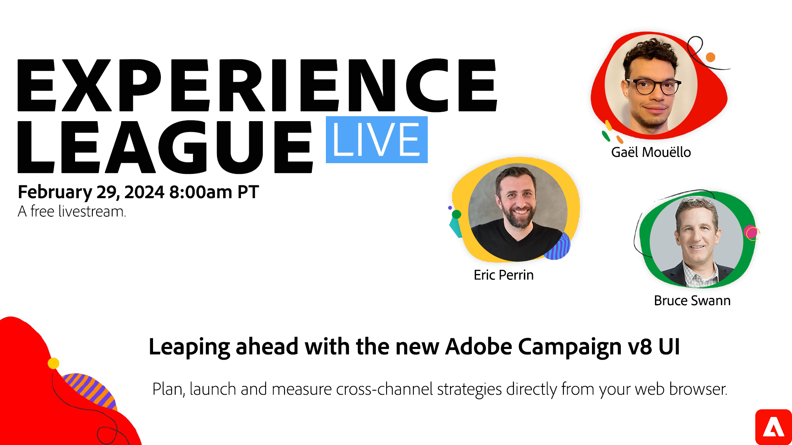

# Avance con la nueva interfaz de usuario de Adobe Campaign v8

La versión 8 de Adobe Campaign tendrá un aspecto completamente nuevo. La experiencia de usuario reinventada simplifica el proceso de diseño de la campaña y es coherente con otras soluciones de Adobe Experience Cloud.

Únase a esta sesión de Experience League Live, en la que los expertos en productos de Adobe Campaign mostrarán cómo planificar, iniciar y medir campañas en canales múltiples en la nueva experiencia del usuario.

**Haga clic en la imagen anterior para establecer un recordatorio de YouTube Live.**