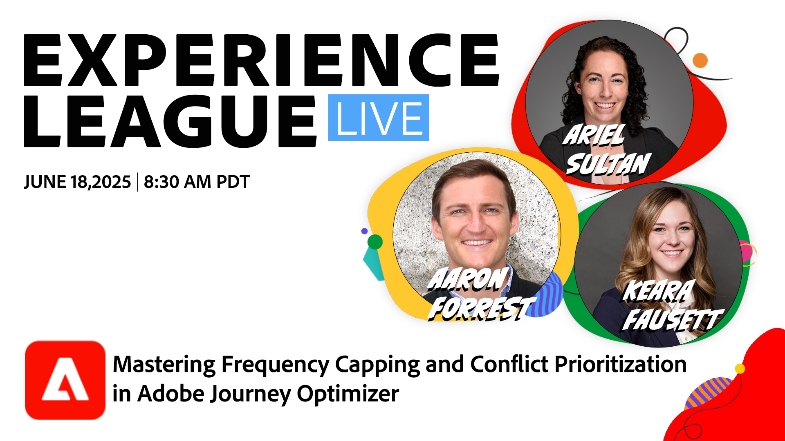

# Límite de frecuencia principal y priorización de conflictos

En esta sesión, los expertos de Adobe Ariel Sultan, Aaron Forrest y Keara Fausett profundizan en las nuevas funciones de Adobe Journey Optimizer para ayudarle a gobernar y priorizar los mensajes de los clientes con precisión. Aprenda a reducir la fatiga de la mensajería, resolver conflictos y ofrecer experiencias impactantes que resuenen.

Esta sesión es ideal para los especialistas en marketing, los equipos de operaciones y los administradores de recorridos que buscan dominar las funcionalidades de Journey Optimizer para obtener un mayor control y eficacia.

No pierda esta oportunidad de transformar sus estrategias de marketing y atraer a su audiencia como nunca antes.

**Haga clic en la siguiente imagen para establecer un recordatorio de YouTube.**

