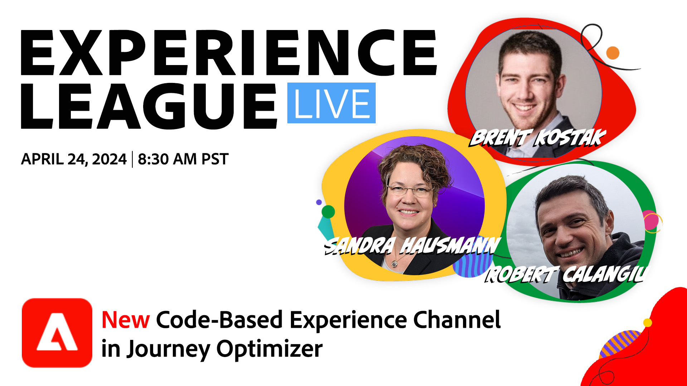

# Experience League LIVE

Experience League LIVE es un programa de streaming en vivo producido por el equipo de Experience League.  Es una oportunidad para conectar con expertos en productos de Adobe y aprender consejos, trucos y estrategias útiles que puede poner en práctica con las aplicaciones de Adobe Experience Cloud.

## Próximos eventos de Experience League LIVE

<table>
<tr>
    <td style="vertical-align: top;">
    

      <a href="episodes/exl-live-episode-03-03-26.md"><strong>Únase a una sesión de preguntas y respuestas con Anjul Bhambhri, vicepresidente senior de Adobe Experience Cloud, para conocer la visión audaz de Adobe sobre las capacidades innovadoras de IA automática.</strong></a>
       <em>con Anjul Bhambhri y Daniel Wright</em>
       <em>3 de marzo de 2026 a las 9:00 PT</em>
        <b><a href="episodes/exl-live-episode-03-03-26.md">Obtenga más información acerca de esta sesión.</a></b>
    

  </td>
</tr>
</table>

<table>
<tr>
    <td style="vertical-align: top;">
    

      <a href="episodes/exl-live-episode-03-12-26.md"><strong>Vea cómo Campaign Orchestration en Journey Optimizer administra sus programas de marketing multicanal grandes y de uno a varios, desde la creación de audiencias hasta el inicio.</strong></a>
       <em>con Sandra Hausmann, Bridgette Darling, Chakravarthy Kalva y Lee Henderson</em>
       <em>12 de marzo de 2026 a las 8:30 PT</em>
        <b><a href="episodes/exl-live-episode-03-12-26.md">Obtenga más información acerca de esta sesión.</a></b>
    

  </td>
</tr>
</table>

## Selección del personal

<table style="max-width: 1214px;">

<tr>
  <td style="vertical-align: top;">
    

      <a href="episodes/exl-live-episode-06-26-24.md">
        <strong>Cómo las últimas versiones de Adobe Real-Time CDP pueden mover la aguja para tu negocio</strong>
      </a>
       <em>con Nina Caruso, Rudi Shumpert y Doug Moore</em>
       <em>26 de junio de 2024</em>
    

  </td>

<td style="vertical-align: top;">
    
    

      <a href="episodes/exl-live-episode-04-24-24.md">
        <strong>Nuevo canal de experiencia basado en código en Journey Optimizer</strong>
      </a>
       <em>con Sandra Hausmann, Robert Calangiu y Brent Kostak</em>
       <em>24 de abril de 2024</em>
    

  </td>
  </tr>

</table>

>[!TIP]
>
>Para obtener más métodos de aprendizaje, vea nuestros [cursos](https://experienceleague.adobe.com/es?lang=es#dashboard/learning) gratuitos, así como [tutoriales](https://experienceleague.adobe.com/docs/home-tutorials.html?lang=es) individuales.

