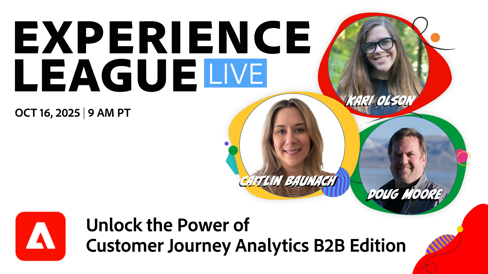

# Experience League LIVE

Experience League LIVE es un programa de streaming en vivo producido por el equipo de Experience League.  Es una oportunidad para conectar con expertos en productos de Adobe y aprender consejos, trucos y estrategias útiles que puede poner en práctica con las aplicaciones de Adobe Experience Cloud.

## Próximos eventos de Experience League LIVE

<table>
    <tr>
        <td style="vertical-align: top;">
            

              <a href="episodes/exl-live-episode-10-16-25.md">
                <strong>Libere el poder de Customer Journey Analytics B2B edition</strong>
              </a>
               <em>con Doug Moore, Kari Olson, Caitlin Baunach</em>
               <em>16 de octubre de 2025</em>
            

        </td>
        <td style="vertical-align: top;">
            

              <a href="episodes/exl-live-episode-10-22-25.md">
                <strong>Experiencias y eficiencia del cliente de próxima generación con Adobe Experience Platform Agent Orchestrator</strong>
              </a>
               <em>con Daniel Wright, Namita Krishnan y Huong Vu</em>
               <em>22 de octubre de 2025</em>
            

        </td>
    </tr>

</table>

## Selección del personal

<table style="max-width: 1214px;">

<tr>
  <td style="vertical-align: top;">
    

      <a href="episodes/exl-live-episode-06-26-24.md">
        <strong>Cómo las últimas versiones de Adobe Real-Time CDP pueden mover la aguja para tu negocio</strong>
      </a>
       <em>con Nina Caruso, Rudi Shumpert y Doug Moore</em>
       <em>26 de junio de 2024</em>
    

  </td>

<td style="vertical-align: top;">
    
    

      <a href="episodes/exl-live-episode-05-16-24.md"><strong>Este es el camino...para migrar Analytics a Web SDK</strong></a>
       <em>con Mitch Rice, Joe Khoury y Doug Moore</em>
       <em>16 de mayo de 2024</em>
    

  </td>

<td style="vertical-align: top;">
    
    

      <a href="episodes/exl-live-episode-04-24-24.md">
        <strong>Nuevo canal de experiencia basado en código en Journey Optimizer</strong>
      </a>
       <em>con Sandra Hausmann, Robert Calangiu y Brent Kostak</em>
       <em>24 de abril de 2024</em>
    

  </td>
  </tr>

</table>

>[!TIP]
>
>Para obtener más métodos de aprendizaje, vea nuestros [cursos](https://experienceleague.adobe.com/?lang=es#dashboard/learning) gratuitos, así como [tutoriales](https://experienceleague.adobe.com/docs/home-tutorials.html?lang=es) individuales.

