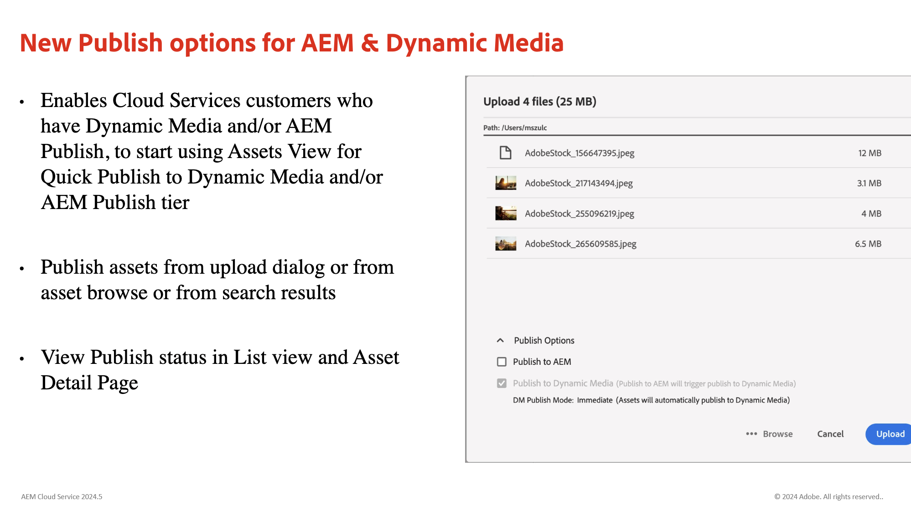
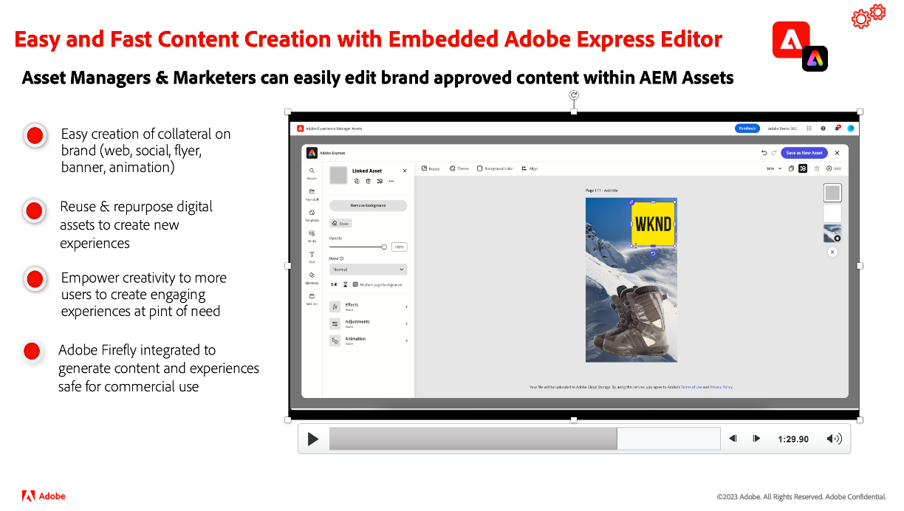

# Actualizaciones de la versión de Adobe Experience Manager as a Cloud Service

Obtenga información general rápida sobre las últimas funciones de Adobe Experience Manager as a Cloud Service. AEM Estos son vídeos cortos, de unos 10 minutos, de parte del equipo de productos de la que comparten los aspectos más destacados de la última versión.

## Última actualización

<table style="max-width: 50%;">
  <tr>
    <td>
      
      

        <a href="2024/2024-5-0.md">
          <strong>Versión | 2024.5.0</strong>
        </a>
      

      <em>Fecha de lanzamiento: mayo de 2024 </em>
      

        <a href="https://experienceleague.adobe.com/docs/experience-manager-cloud-service/content/release-notes/release-notes/release-notes-current.html?lang=es">Notas de la versión</a>
      

    </td>
  </tr>  
</table>

## Actualizaciones anteriores

<table style="max-width: 50%;">
  <tr>
    <td>
      
      

        <a href="2024/2024-4-0.md">
          <strong>Versión | 2024.4.0</strong>
        </a>
      

      <em>Fecha de publicación: abril de 2024 </em>
    </td>
    <td>
      
      

        <a href="2024/2024-3-0.md">
          <strong>Versión | 2024.3.0</strong>
        </a>
      

      <em>Fecha de publicación: abril de 2024 </em>
    </td>
    <td>
      
      

        <a href="2024/2024-1-0.md">
          <strong>Versión | 2024.1.0</strong>
           
        </a>
          <em>Fecha de la versión: enero de 2024 </em>
      

    </td>
  </tr>
  <tr>
    <td>
      
      

        <a href="2023/2023-11-0.md">
          <strong>Versión | 2023.11.0</strong>
           
        </a>
          <em>Fecha de la versión: noviembre de 2023 </em>
      

    </td>
    <td>
      
      

        <a href="2023/2023-10-0.md">
          <strong>Versión | 2023.10.0</strong>
           
        </a>
          <em>Fecha de la versión: octubre de 2023 </em>
      

    </td>
    <td>
      
      

        <a href="2023/2023-9-0.md">
          <strong>Versión | 2023.9.0</strong>
           
        </a>
          <em>Fecha de versión: septiembre de 2023 </em>
      

    </td>
  </tr>
  <tr>    
    <td>
      
      

        <a href="2023/2023-8-0.md">
          <strong>Versión | 2023.8.0</strong>
           
        </a>
          <em>Fecha de lanzamiento: agosto de 2023 </em>
      

    </td>
    <td>
      
      

        <a href="2023/2023-7-0.md">
          <strong>Versión | 2023.7.0</strong>
           
        </a>
          <em>Fecha de la versión: julio de 2023 </em>
      

    </td>
    <td>
      
      

        <a href="2023/2023-6-0.md">
          <strong>Versión | 2023.6.0</strong>
           
        </a>
          <em>Fecha de publicación: junio de 2023 </em>
      

    </td>
  </tr>
</table>
