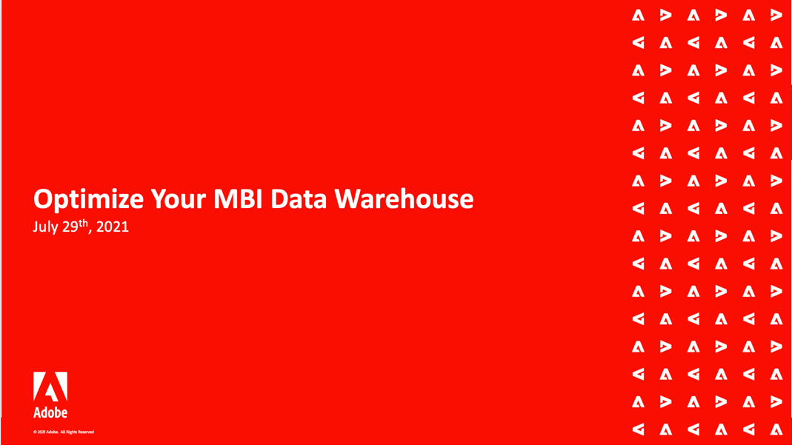

# Seminarios web de Adobe Commerce Intelligence

>[!NOTE]
>
>Adobe Commerce Intelligence se conocía anteriormente como [!DNL Magento Business Intelligence (MBI)]. Las grabaciones de eventos anteriores reflejan el nombre anterior.

La serie de seminarios web de Commerce Intelligence es un evento periódico para clientes de MBI. Los seminarios web cubren una amplia gama de temas y prácticas recomendadas para utilizar Commerce Intelligence al máximo de su potencial.

Los asistentes de todas las regiones geográficas pueden unirse a los eventos en directo para comprender mejor el producto y para obtener respuestas directas a sus preguntas sobre la funcionalidad de Commerce Intelligence.

Los temas se repiten ocasionalmente para dar cabida a cualquier nueva pregunta que los clientes puedan hacer.

## Selección de personal

<table>
<tr>
  <td>
    
     

      <a href="https://experienceleague.adobe.com/docs/events/mbi-webinars-recordings/2021/getting-started.html">
        <strong>Introducción a MBI</strong>
      </a>
    

    

    <em>Obtenga información sobre las funciones principales de Commerce Intelligence directamente desde el equipo del producto, con una explicación exhaustiva de los paneles preconfigurados y las opciones de personalización disponibles.</em>
    

  </td>
  <td>
    
     

      <a href="https://experienceleague.adobe.com/docs/events/mbi-webinars-recordings/2023/manage-data-sets.html">
        <strong>Administrar conjuntos de datos en MBI</strong>
      </a>
    

    

    <em>Obtenga información sobre algunas de las potentes funciones del administrador de Data Warehouse de MBI, directamente desde el equipo de productos de Adobe Commerce. Supere la creación básica de informes y aprenda a hacer más con sus datos.</em>
    

  </td>
   <td>
    
     

      <a href="https://experienceleague.adobe.com/docs/events/mbi-webinars-recordings/2021/optimize-data-warehouse.html">
        <strong>Optimizar el Data Warehouse de MBI</strong>
      </a>
    

    

    <em>Con el Administrador de Datas Warehouse, puede administrar la configuración de sincronización de columnas y tablas, explorar en profundidad el esquema de una tabla y crear columnas calculadas para utilizarlas en los informes.</em>
    

  </td>
</tr>
</table>

>[!TIP]
>
>**Todos los seminarios web grabados se enumeran en la sección de navegación de la izquierda**.

## Recursos útiles

- [Vídeos y tutoriales de Commerce Intelligence](https://experienceleague.adobe.com/docs/commerce-learn/tutorials/mbi/filter-sets.html)
- [Guía del usuario de Commerce Intelligence](https://experienceleague.adobe.com/docs/commerce-business-intelligence/mbi/guide-overview.html?lang=es)
