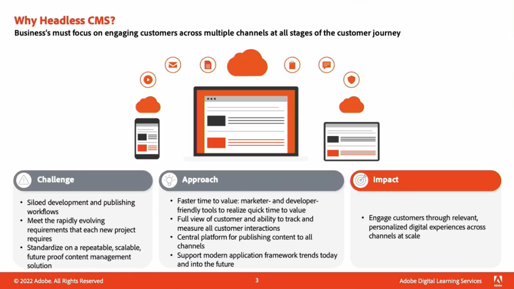

# Contenido y comercio

Cree y administre una amplia gama de atractivos sitios web, aplicaciones móviles y formularios. Además, aprenda a crear experiencias de comercio multicanal en una sola plataforma con nuestra solución de comercio flexible y basada en IA.

## Novedades

<table>
<tr>
  <td>
    
     

      <a href="https://experienceleague.adobe.com/docs/skill-builder-events/skill-builder/content-and-commerce/2022/headless.html">
        <strong>Ofrecer experiencias sin encabezado con Adobe Experience Manager</strong>
      </a>
    

    

    <em>Obtenga información sobre la administración de experiencias sin encabezado mediante las mejoras más recientes de Fragmento de contenido en Experience Manager y la nueva API de GraphQL para la entrega de contenido sin encabezado.</em>
    

  </td>
  <td>
    
     

      <a href="https://experienceleague.adobe.com/docs/skill-builder-events/skill-builder/content-and-commerce/2022/metadata.html">
        <strong>Haga que los metadatos trabajen para su negocio en Adobe Experience Manager Assets</strong>
      </a>
    

    

    <em>Aprenda a sacar el máximo partido a los metadatos en AEM Assets reduciendo la carga de trabajo de etiquetas de recursos y haciendo que sea más sencillo buscar en sus activos.</em>
    

  </td>  
  <td>
    
     

      <a href="https://experienceleague.adobe.com/docs/skill-builder-events/skill-builder/content-and-commerce/2022/workflow.html">
        <strong>Aproveche al máximo la administración de flujos de trabajo empresariales</strong>
      </a>
    

    

    <em>En esta sesión, aprenderá las ventajas de utilizar flujos de trabajo para la administración de recursos y cómo crearlos rápidamente.</em>
    

  </td>
</tr>
</table>

>[!TIP]
>
>**Todas las sesiones grabadas se muestran en el panel de navegación de la izquierda**.
