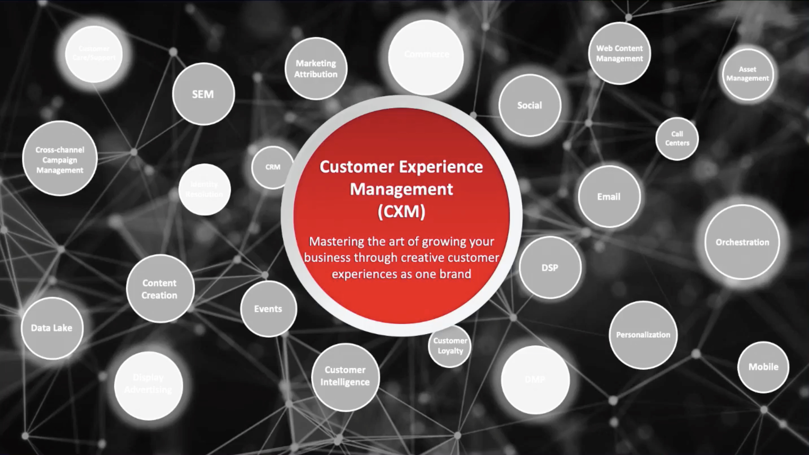

# Recorridos del cliente

Desarrolle perfiles de clientes en tiempo real extrayendo datos de todas las fuentes para crear recorridos personalizados en canales múltiples.

## Novedades

<table>
<tr>
  <td>
    
     

      <a href="https://experienceleague.adobe.com/docs/skill-builder-events/skill-builder/customer-journeys/2022/b2b-campaigns.html">
        <strong>Mejor juntos: Adobe Marketo Engage y Real-Time CDP</strong>
      </a>
    

    

    <em>Aprenda a organizar campañas B2B con Marketo Engage y RT-CDP (edición B2B), y cuáles son los casos prácticos y las ventajas más importantes.</em>
    

  </td>
  <td>
    
     

      <a href="https://experienceleague.adobe.com/docs/skill-builder-events/skill-builder/customer-journeys/2022/data-models.html">
        <strong>Desarrollar y personalizar modelos de datos en Adobe Campaign Classic</strong>
      </a>
    

    

    <em>Únase a esta sesión con nuestro instructor de Campaign para aprender a desarrollar un esquema de datos dentro de un modelo de datos de Campaign Classic.</em>
    

  </td>  
  <td>
    
     

      <a href="https://experienceleague.adobe.com/docs/skill-builder-events/skill-builder/customer-journeys/2022/tips-and-tricks.html">
        <strong>Principales sugerencias y trucos para Adobe Campaign Standard</strong>
      </a>
    

    

    <em>Conecte la instancia de Adobe Campaign Standard y aprenda prácticas recomendadas sobre segmentación, personalización y fatiga de marketing para aprovechar mejor ACS.</em>
    

  </td>
</tr>
</table>

>[!TIP]
>
>**Todas las sesiones grabadas se muestran en el panel de navegación de la izquierda**.
