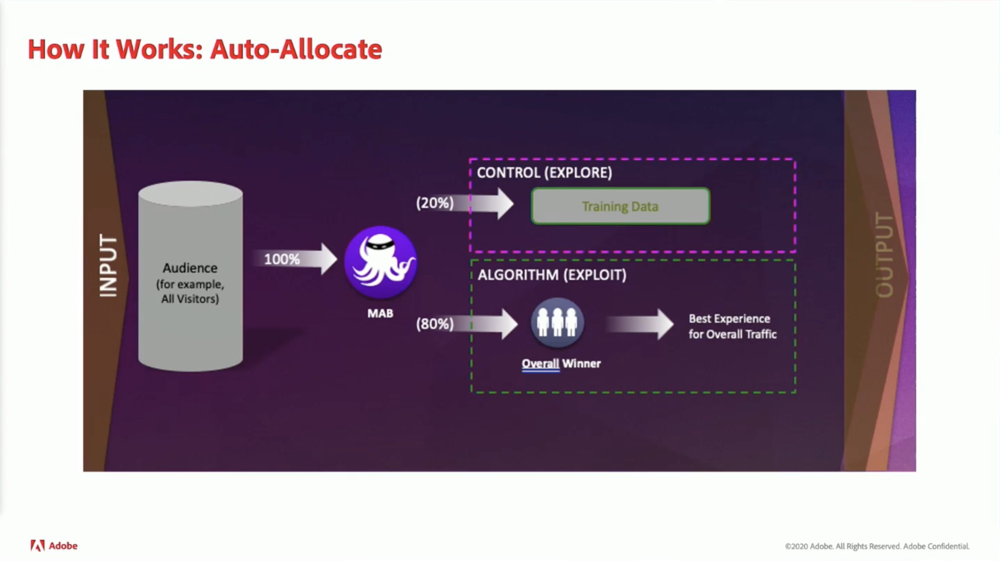
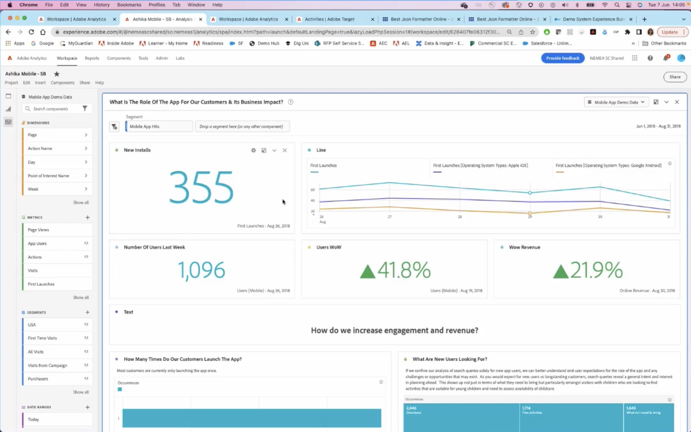

# Datos y perspectivas

Impulse la personalización en tiempo real en cualquier canal mediante perspectivas de datos en línea y sin conexión en toda la organización.

## Novedades

<table>
<tr>
  <td>
    
     

      <a href="https://experienceleague.adobe.com/docs/events//data-and-insights/2022/personalize.html">
        <strong>Personalización y automatización con Adobe Target</strong>
      </a>
    

    

    <em>Únase a esta sesión para conocer los conceptos básicos de automatización y optimización de las capacidades de Adobe Target mediante la Segmentación automática y las Personalizaciones automáticas.</em>
    

  </td>
  <td>
    
     

      <a href="https://experienceleague.adobe.com/docs/events//data-and-insights/2022/innovations.html">
        <strong>2022 Innovaciones y tendencias</strong>
      </a>
    

    

    <em>En esta sesión principal, aprenderá sobre las principales tendencias en D&amp;I. Únase a nosotros para explorar cómo puede hacer un uso relevante de sus datos maximizando al máximo sus inversiones de Experience Cloud y echar un vistazo a las nuevas innovaciones.</em>
    

  </td>  
  <td>
    
     

      <a href="https://experienceleague.adobe.com/docs/events//data-and-insights/2022/mobile-and-apps.html">
        <strong>Aplicaciones de Analytics y Target para aplicaciones móviles y móviles</strong>
      </a>
    

    

    <em>En esta sesión, aprenderá las prácticas recomendadas sobre cómo utilizar paneles de Analytics en dispositivos móviles, así como sobre cómo personalizar aplicaciones a través de Target.</em>
    

  </td>
</tr>
</table>

>[!TIP]
>
>**Todas las sesiones grabadas se muestran en el panel de navegación de la izquierda**.
